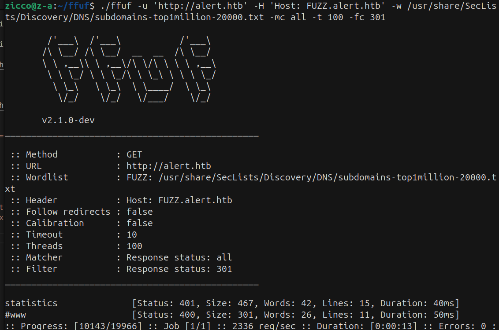

## HackTheBox Machine


### Link: https://app.hackthebox.com/machines/Alert
-------------------------------------------------------

### RECON:
+ Scan open port in the machine:

```bash
$ nmap -sV -vv -A -T4 -p- alert.htb
PORT      STATE    SERVICE REASON      VERSION
22/tcp    open     ssh     syn-ack     OpenSSH 8.2p1 Ubuntu 4ubuntu0.11 (Ubuntu Linux; protocol 2.0)
| ssh-hostkey: 
|   3072 7e:46:2c:46:6e:e6:d1:eb:2d:9d:34:25:e6:36:14:a7 (RSA)
| ssh-rsa 
|   256 45:7b:20:95:ec:17:c5:b4:d8:86:50:81:e0:8c:e8:b8 (ECDSA)
| ecdsa-sha2-nistp256 
|   256 cb:92:ad:6b:fc:c8:8e:5e:9f:8c:a2:69:1b:6d:d0:f7 (ED25519)
|_ssh-ed25519 AAAAC3NzaC1lZDI1NTE5AAAAIG/QUl3gapBOWCGEHplsOKe2NlWjlrb5vTTLjg6gMuGl
80/tcp    open     http    syn-ack     Apache httpd 2.4.41 ((Ubuntu))
| http-title: Alert - Markdown Viewer
|_Requested resource was index.php?page=alert
|_http-server-header: Apache/2.4.41 (Ubuntu)
| http-methods: 
|_  Supported Methods: GET HEAD POST OPTIONS
12227/tcp filtered unknown no-response
Service Info: OS: Linux; CPE: cpe:/o:linux:linux_kernel
```

+ Enumerate the all directories:

```bash
$ gobuster dir -u http://alert.htb -w /usr/share/wordlists/dirb/common.txt -xtxt -t64
===============================================================
Starting gobuster in directory enumeration mode
===============================================================

/contact.php          (Status: 200) [Size: 24]
/css                  (Status: 301) [Size: 304] [--> http://alert.htb/css/]
/index.php            (Status: 302) [Size: 660] [--> index.php?page=alert]
/index.php            (Status: 302) [Size: 660] [--> index.php?page=alert]
/messages             (Status: 301) [Size: 309] [--> http://alert.htb/messages/]
/messages.php         (Status: 200) [Size: 1]
/server-status        (Status: 403) [Size: 274]
/uploads              (Status: 301) [Size: 308] [--> http://alert.htb/uploads/]
Progress: 18456 / 18460 (99.98%)
===============================================================
Finished
```

+ Enumerate valid subdomain of `alert.htb`:

```bash
$ ./ffuf -u 'http://alert.htb' -H 'Host: FUZZ.alert.htb' -w /usr/share/SecLists/Discovery/DNS/subdomains-top1million-20000.txt -mc all -t 100 -fc 301
```



