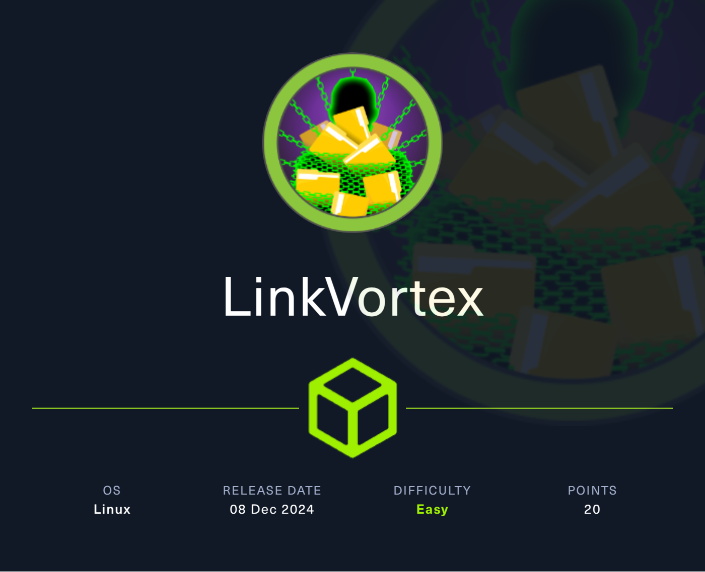

## HackTheBox Machine


### Machine: [Link_Vortex](https://app.hackthebox.com/machines/LinkVortex)
------------------------------------------------------------------

### RECON:
+ Scan open ports of the machine:

```bash
$ nmap -sV -vv -A -p- -T4 linkvortex.htb
PORT   STATE SERVICE REASON  VERSION
22/tcp open  ssh     syn-ack OpenSSH 8.9p1 Ubuntu 3ubuntu0.10 (Ubuntu Linux; protocol 2.0)
| ssh-hostkey: 
|   256 3e:f8:b9:68:c8:eb:57:0f:cb:0b:47:b9:86:50:83:eb (ECDSA)
| ecdsa-sha2-nistp256 AAAAE2VjZHNhLXNoYTItbmlzdHAyNTYAAAAIbmlzdHAyNTYAAABBBMHm4UQPajtDjitK8Adg02NRYua67JghmS5m3E+yMq2gwZZJQ/3sIDezw2DVl9trh0gUedrzkqAAG1IMi17G/HA=
|   256 a2:ea:6e:e1:b6:d7:e7:c5:86:69:ce:ba:05:9e:38:13 (ED25519)
|_ssh-ed25519 AAAAC3NzaC1lZDI1NTE5AAAAIKKLjX3ghPjmmBL2iV1RCQV9QELEU+NF06nbXTqqj4dz
80/tcp open  http    syn-ack Apache httpd
| http-methods: 
|_  Supported Methods: POST GET HEAD OPTIONS
|_http-favicon: Unknown favicon MD5: A9C6DBDCDC3AE568F4E0DAD92149A0E3
| http-robots.txt: 4 disallowed entries 
|_/ghost/ /p/ /email/ /r/
|_http-server-header: Apache
|_http-title: BitByBit Hardware
|_http-generator: Ghost 5.58
Service Info: OS: Linux; CPE: cpe:/o:linux:linux_kernel
```

+ Finding Subdomain:
```bash
$ ./ffuf -u 'http://linkvortex.htb' -H 'Host: FUZZ.linkvortex.htb' -w /usr/share/SecLists/Discovery/DNS/subdomains-top1million-20000.txt -mc all -t 100 -fc 301

        /'___\  /'___\           /'___\       
       /\ \__/ /\ \__/  __  __  /\ \__/       
       \ \ ,__\\ \ ,__\/\ \/\ \ \ \ ,__\      
        \ \ \_/ \ \ \_/\ \ \_\ \ \ \ \_/      
         \ \_\   \ \_\  \ \____/  \ \_\       
          \/_/    \/_/   \/___/    \/_/       

       v2.1.0-dev
________________________________________________

 :: Method           : GET
 :: URL              : http://linkvortex.htb
 :: Wordlist         : FUZZ: /usr/share/SecLists/Discovery/DNS/subdomains-top1million-20000.txt
 :: Header           : Host: FUZZ.linkvortex.htb
 :: Follow redirects : false
 :: Calibration      : false
 :: Timeout          : 10
 :: Threads          : 100
 :: Matcher          : Response status: all
 :: Filter           : Response status: 301
________________________________________________

dev                     [Status: 200, Size: 2538, Words: 670, Lines: 116, Duration: 53ms]
```

+ Enumerate the directories Subdomain `dev.linkvortex.htb`:
```bash
$ gobuster dir -u http://dev.linkvortex.htb/ -w /usr/share/wordlists/dirb/common.txt -t64
===============================================================
/.git/HEAD            (Status: 200) [Size: 41]
/index.html           (Status: 200) [Size: 2538]
Progress: 4614 / 4615 (99.98%)
===============================================================
Finished
===============================================================
```


